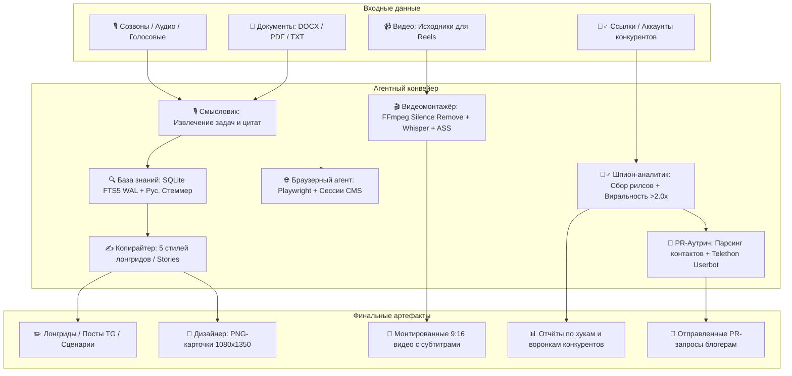

# 🚀 Content Agent System

> **Многоагентная ИИ-система полного цикла для производства контента, видеомонтажа, конкурентного шпионажа, самообучения и веб-автоматизации** — от расшифровки созвонов и базы знаний FTS5 до готовых постов в 5 стилях, 9:16 видеомонтажа с субтитрами, генерации каруселей 1080×1350, исполнения регламентов по рецептам задач, OSINT-разведки (SpiderFoot) и непрерывного самообучения на правках эксперта.

[](https://www.python.org/downloads/)
[](https://opensource.org/licenses/MIT)
[](https://github.com/aiogram/aiogram)
[](https://cloud.google.com)
[](https://ffmpeg.org)
[](https://playwright.dev)

---

## 📌 Архитектура и принцип работы

Главный принцип системы — **«Первые принципы, упаковка реального опыта и нулевой vendor lock-in»**:
1. **Суверенитет данных (Data Sovereignty)**: Все материалы, транскрипты, база знаний и лиды хранятся локально в открытых форматах (Markdown, JSON, SQLite WAL).
2. **Разделение труда (Agentic Separation of Concerns)**: Каждая роль выполняет строго одну задачу. Производство контента и факт-чекинг изолированы.
3. **Защита от галлюцинаций (Zero-Fluff Fact Checking)**: Интегрированная локальная база знаний SQLite FTS5 с морфологическим поиском по русскому языку динамически подмешивает реальные цифры, кейсы и цитаты эксперта прямо в промпт копирайтера.
4. **Мультимодальный конвейер**: Текст, звук, видео, изображения и управление браузером объединены в одном интерфейсе Telegram.



---

## 👥 Команда специалистов и роли

| Специалист | Роль / Команда | Описание и функционал |
|---|---|---|
| ✍️ **Копирайтер** | `/post`, `copywriter` | 5 стилей лонгридов (Драма, Провокация, Чек-лист, Аналитика, Манифест), сценарии Stories, прогревы и хуки ВИСП. |
| 🎨 **Дизайнер** | `/karusel`, `/adapt` | Проектирование структуры и программная верстка каруселей 1080×1350 в PNG (Pillow), адаптация чужих карточек. |
| 🔍 **Главред** | `/check`, `editor` | Жесткий факт-чекинг по `materials/`, вычитка стоп-слов, канцелярита, контроль тире и правила «диагноз бесплатно, лечение в продукте». *(Read-Only)* |
| 🎙 **Смысловик** | `/sozvon`, `analyst` | Расшифровка аудиозаписей, кружков и транскриптов: извлечение задач по исполнителям, инсайтов и дословных цитат. |
| 🎬 **Видеомонтажёр** | `/montage` | Автоматический монтаж видео: вырезание пауз (`silenceremove`), генерация транскрипта Whisper и вжигание стильных вертикальных субтитров 9:16. |
| 🕵️‍♂️ **Шпион-аналитик** | `/spy`, `/insta` | Пакетный парсинг до 100 рилсов профиля, вычисление виральности (>2.0x медианы), анализ хуков, структур и офферов. |
| 🌐 **Браузерный агент** | `/browser` | Playwright-автоматизация: скриншотинг страниц, поддержка авторизованных сессий (Tilda, GetCourse, Telegram Web). |
| 📢 **PR-Аутрич** | `/outreach` | Извлечение контактов блогеров из bio и постов, база лидов в SQLite, генерация питчей и безопасная рассылка через userbot. |
| ⚙️ **Техспециалист** | `/status`, `/index`, `tech` | Инфраструктура проекта, FTS5 база знаний, серверное окружение, LLM-маршрутизация (Antigravity CLI, Claude, Gemini). |

---

## 📌 5 стилей лонгридов (`.agents/skills/style-*/`)

Система поддерживает 5 калиброванных форматов публикаций по стандарту [agentskills.io](https://agentskills.io):

1. 🎭 **Драма & Факап** (`/post 1 [тема]`):
   - Личная история, уязвимость, кризис, точка слома и преодоление.
   - Максимальный уровень эмоционального доверия аудитории.
2. 🔥 **Провокация & Мифбастер** (`/post 2 [тема]`):
   - Разрушение рыночных стереотипов, контраст «как делают все vs как правильно».
   - Драйвер комментариев, споров и вовлеченности.
3. 📋 **Чек-лист & Регламент** (`/post 3 [тема]`):
   - Системный пошаговый алгоритм, нумерация, критерии готовности без воды.
   - Драйвер закладок, сохранений и пересылок коллегам.
4. 📊 **Аналитика & Цифры** (`/post 4 [тема]`):
   - Юнит-экономика, окупаемость, когорты, LTV, возвращаемость, твердые расчеты.
   - Формирование статуса методолога и эксперта с твердыми результатами.
5. 🏛 **Манифест & Ценности** (`/post 5 [тема]`):
   - Принципы сервиса, философия работы эксперта, фильтр «свой-чужой».
   - Привлечение единомышленников и отсев токсичных клиентов.

---

## 🛠 Компоненты системы

### 1. Локальная база знаний SQLite FTS5 (`knowledge_base.py`)
- Локальное хранилище в режиме `WAL` (`data/knowledge.db`).
- **Специфика русского языка**: Встроенный морфологический псевдо-стеммер `stem_russian()` (`клиентов` → `клиент*`, `выручка` → `выруч*`) и фильтрация стоп-слов.
- Быстрая команда `/index` для переиндексации директории `materials/`.
- Автоматическая динамическая инъекция релевантного контекста в промпты копирайтера.

### 2. Пакетный шпион конкурентов (`insta_batch.py`)
- Пакетный сбор до 100 рилсов профиля конкурента.
- **Алгоритм виральности**: вычисление медианы engagement-показателя (`views` / `likes*3 + comments*5`) и автоматический отбор публикаций **> 2.0x медианы**.
- Разбор хуков первых 3 секунд, логики удержания внимания, офферов и кодовых слов для Direct.
- Автоматическое сохранение отчетов в `data/competitors/` и индексация в FTS5.

### 3. Программный видеомонтаж (`video_pipeline.py`)
- **FFmpeg Silence Removal**: автоматическое удаление пауз тишины и вздохов (`<-32dB, >0.35s`), создающее динамичный темп речи.
- **Whisper Speech-to-Text**: посегментная и пословная транскрибация с миллисекундными таймкодами.
- **Стилизованные вертикальные субтитры (ASS 9:16)**:
  - Разрешение 1080×1920, крупный шрифт 72pt, акцентный желтый цвет (`#FEE800`) с белым.
  - Черная обводка и тень для контраста на любом фоне.
  - Безопасные отступы под интерфейс Instagram Reels / Shorts (отступ снизу 420px).
- Вжигание субтитров через `ffmpeg` в готовый MP4.

### 4. Браузерный агент (`browser_worker.py`)
- Движок **Playwright** (Chromium Headless).
- Снятие полностраничных скриншотов веб-страниц по URL.
- Поддержка сохранения авторизованных сессий (`data/browser/storage_state.json`) для работы в личных кабинетах (Tilda, GetCourse).

### 5. Агент PR-аутрича (`outreach_worker.py`)
- Регулярные выражения для надежного извлечения `@username` и `t.me/...` из bio профилей и постов.
- Локальная база лидов SQLite (`data/outreach.db`) со статусами `new`, `sent`, `replied`, `declined`.
- Генератор персонализированных конверсионных питчей на рекламу.
- Безопасная очередь отправки через клиент **Telethon** (userbot) с рандомизированными паузами против блокировок.

### 7. Система самообучения и памяти ToV (`learning_engine.py`)
- **Diff-анализ правок эксперта**: когда эксперт отвечает (Reply) на черновик бота отредактированным текстом, агент автоматически сравнивает версии, извлекает удаленные штампы и добавленные живые обороты.
- **Прямая кодификация (`/learn`)**: эксперт может явно закрепить правило («Никогда не начинай с 'Привет, друзья'», «Пиши 'тестовый день' вместо 'собеседование'»).
- **База выученных правил**: локальная SQLite БД `data/learning.db` с категориями `stop_word`, `preferred_term`, `tone_rule`.
- **Зал славы (Few-Shot Golden Dataset)**: сохранение лучших постов как золотых эталонов для каждого стиля.
- **Динамическая инъекция**: правила автоматически встраиваются в промпты Копирайтера и чек-лист Главреда.

### 8. Система проверенных рецептов задач (`recipe_runner.py`)
- **Интеграция с библиотекой рецептов**: подключение к каталогу `~/Project CODE/krasava-bridge/skill/recipes/` (GetCourse, Tilda, VK, YouTube, Директ, Метрика).
- **Устранение слепого тыканья**: вместо десятков случайных шагов агент действует строго по проверенному алгоритму с обходом платформенных «капканов».
- **Команды**: `/recipes` — список сценариев, `/recipe [домен]` — регламент и капканы, `/recipe run [домен]` — исполнение в браузере Playwright.

### 9. OSINT-разведка в стиле SpiderFoot (`recon_spider.py`)
- **Username Pivoting**: быстрая проверка присутствия никнейма по 8+ платформам (Telegram, YouTube, VK, Дзен, TikTok, VC.ru, Rutube, TenChat).
- **Краулер мультиссылок и лендингов**: парсинг Taplink / Tilda / сайтов для извлечения PR-контактов (Telegram, WhatsApp, email).
- **Tech Stack Profiling**: автоматическое определение CMS (Tilda, WordPress), LMS (GetCourse), CRM (AmoCRM, Bitrix24), ID Яндекс Метрики и пикселей VK.
- **Юридический след**: извлечение ИП, ООО, ИНН и ОГРН из оферты и политики конфиденциальности.
- **Команда**: `/recon [username или URL]` с авто-подачей найденных контактов в очередь аутрича.

### 6. Генератор каруселей 1080×1350 (`carousel_generator/`)
- Генерация слайдов высокой четкости **1080×1350 (4:5)** на базе **Pillow (PIL)**.
- Автоматический перенос строк, расчет вертикальных отступов и выравнивание.
- Типографическая система: обложки (`cover`), акцентные перебивки (`break`), списки и чек-листы (`list`), финальные слайды с CTA (`cta`).
- Поддержка авто-кадрирования аватара эксперта на обложке и в финале.

---

## ⌨️ Команды Telegram-бота

| Команда | Параметры | Описание |
|---|---|---|
| `/post` | `[стиль] [тема]` | Написание лонгрида живым голосом эксперта (с выбором стиля 1..5 или инлайн-кнопками). |
| `/karusel` | `[тема]` | Генерация структуры и компиляция готовых карточек PNG 1080×1350. |
| `/adapt` | `[текст / скриншот]` | Адаптация чужой карусели конкурента под голос эксперта и сборка PNG. |
| `/spy` | `[аккаунт] [лимит]` | Пакетный шпионаж: парсинг до 100 рилсов, виральность >2.0x, декомпозиция хуков и офферов. |
| `/montage` | *(или прикрепить видео)* | Программный монтаж: вырезка пауз + Whisper транскрипт + стильные 9:16 субтитры. |
| `/browser` | `[URL]` | Браузерный агент: загрузка страницы и отправка скриншота в чат. |
| `/outreach` | `[stats \| add \| send]` | Управление PR-аутричем блогеров: статистика, добавление контактов, запуск рассылки. |
| `/recon` | `[username \| URL]` | OSINT-разведка в стиле SpiderFoot: досье, сетка аккаунтов, стек воронки, контакты и ИП. |
| `/funnel` | `[тема]` | Сквозная автоворонка под ключ: пост + HVCO лид-магнит + бот «Микроволновка» + JSON/MD экспорт. |
| `/magnet` | `[тема]` | Генератор продающих лид-магнитов + кодового слова в бот (методология Анарбаевой 2026). |
| `/blueprint` | `[тема]` | Генерация архитектурного Blueprint / Miro-карты системы со связками и конверсиями. |
| `/recipes` | — | Каталог проверенных рецептов веб-автоматизации (GetCourse, Tilda, VK, YouTube). |
| `/recipe` | `[домен]` или `run` | Просмотр регламента платформы с капканами или запуск выполнения в браузере. |
| `/learn` | `[инструкция]` | Прямое обучение бота правилам Tone of Voice, стоп-словам или терминам эксперта. |
| `/rules` | — | Просмотр и управление базой выученных правил Tone of Voice (`/delrule [ID]`). |
| `/insta` | `[ссылка на Reels/пост]` | Скачивание, расшифровка и ремикс одиночного рилса/поста. |
| `/check` | `[текст]` | Задача для Главреда: факт-чек, проверка первоисточников и вычитка стоп-слов. |
| `/sozvon` | *(файл или аудио)* | Задача для Смысловика: разбор записи созвона, выделение задач и цитат. |
| `/index` | — | Запуск переиндексации папки `materials/` в базу знаний SQLite FTS5. |
| `/status` | — | Проверка статуса инфраструктуры, файлов, FTS5 и доступности Playwright. |
| `/setup_forum` | — | Автоматическое создание 5 рабочих веток специалистов в Telegram-форуме. |

---

## 📂 Структура проекта

```
content-agent-system/
├── .agents/
│   ├── plans/                 # Архитектурные планы эволюции системы
│   └── skills/                # Открытый стандарт skills (agentskills.io)
│       ├── style-drama/       # 🎭 1. Драма & Факап
│       ├── style-provocation/ # 🔥 2. Провокация & Мифбастер
│       ├── style-checklist/   # 📋 3. Чек-лист & Регламент
│       ├── style-analytics/   # 📊 4. Аналитика & Цифры
│       ├── style-manifest/    # 🏛 5. Манифест & Ценности
│       ├── funnel-architect/          # 🚀 Сквозные автоворонки под ключ (Кадыров, Хормози, Суби)
│       ├── lead-magnet-sales-engine/ # 🧲 Генератор продающих лид-магнитов и Blueprint 2026
│       ├── expert-storytelling/
│       ├── tg-channel-posts/
│       └── visp-hooks/
├── .claude/
│   ├── agents/                # Промпты ролей для Claude Code (.md)
│   └── skills/                # Скиллы проекта для Claude Code
├── data/                      # Локальные базы и хранилище (в .gitignore)
│   ├── knowledge.db           # SQLite FTS5 База Знаний (WAL)
│   ├── outreach.db            # SQLite База PR-лидов
│   ├── competitors/           # Отчёты аудита конкурентов
│   ├── browser/               # Сессии браузера Playwright
│   └── video_output/          # Смонтированные видео MP4
├── materials/                 # Первоисточники эксперта (транскрипты, выгрузки)
├── 02 Разборы созвонов/       # Сохраненные разборы смысловика
├── tg_bot/
│   ├── main.py                # Точка входа Telegram-бота (Aiogram 3.x)
│   ├── config.py              # Конфигурация и переменные окружения
│   ├── requirements.txt       # Python-зависимости бота
│   ├── deploy/                # Systemd service и скрипты деплоя
│   ├── engine/
│   │   ├── agent_runner.py    # LLM-оркестратор (Antigravity / Claude / Gemini / FTS5)
│   │   ├── knowledge_base.py  # SQLite FTS5 движок + русский стеммер
│   │   ├── insta_batch.py     # Пакетный парсер рилсов и фильтр виральности >2.0x
│   │   ├── video_pipeline.py  # FFmpeg silenceremove + Whisper + ASS субтитры
│   │   ├── browser_worker.py  # Playwright агент, скриншотинг и сессии
│   │   ├── outreach_worker.py # PR-аутрич, regex контактов и Telethon userbot
│   │   ├── carousel_builder.py# Динамическая сборка карточек из JSON
│   │   ├── file_extractor.py  # Извлечение текста из docx, pdf, аудио
│   │   ├── formatter.py       # Telegram HTML / MarkdownV2 форматирование
│   │   ├── insta_monitor.py   # Модуль мониторинга и ремикса рилсов
│   │   └── prompts.py         # Менеджер промптов и инъекции 5 стилей
│   └── handlers/
│       └── router.py          # Роутер команд, форумов и мультимодальных сообщений
├── carousel_generator/
│   ├── build_karusel.py       # Движок верстки слайдов на Pillow
│   ├── decks.py               # Шаблоны и примеры каруселей
│   └── photo.jpg              # Аватар для обложек и CTA
├── AGENTS.md                  # Корневой манифест правил системы и голоса
├── CLAUDE.md                  # Системные инструкции для Claude Code
├── .env.example               # Шаблон переменных окружения
├── .gitignore
├── LICENSE                    # MIT License
├── requirements.txt
└── README.md
```

---

## ⚡️ Быстрый старт

### 1. Клонирование и установка зависимостей

```bash
git clone https://github.com/alexrexby/content-agent-system.git
cd content-agent-system

python3 -m venv venv
source venv/bin/activate  # На Windows: venv\Scripts\activate
pip install -r requirements.txt
```

### 2. Установка системных инструментов (FFmpeg & Playwright)

Для работы видеомонтажа и браузерного агента:

- **macOS**:
  ```bash
  brew install ffmpeg
  playwright install chromium
  ```
- **Ubuntu / Debian**:
  ```bash
  sudo apt update && sudo apt install -y ffmpeg
  playwright install --with-deps chromium
  ```

### 3. Настройка переменных окружения

Скопируйте `.env.example` в `.env` и укажите необходимые ключи:

```bash
cp .env.example .env
```

Пример конфигурации `.env`:
```ini
# Токен бота из @BotFather
BOT_TOKEN=1234567890:ABCdefGHIjklMNOpqrSTUvwxYZ

# API-ключ для Claude 3.5 / Polza AI (или прямой OpenAI / Gemini)
POLZA_API_KEY=your_polza_api_key
AI_BASE_URL=https://api.polza.ai/api/v1
CLAUDE_MODEL=anthropic/claude-sonnet-4.5

# Опционально: Google Gemini
GEMINI_API_KEY=AIzaxxxxxxxxxxxxx

# Юзернейм канала/блога для каруселей
EXPERT_HANDLE=@expert_channel

# Опционально: Telethon Userbot для PR-аутрича (/outreach)
TELEGRAM_API_ID=1234567
TELEGRAM_API_HASH=abcdef0123456789abcdef0123456789
```

### 4. Первичная индексация материалов

Поместите файлы эксперта (`.docx`, `.txt`, `.pdf`, расшифровки) в папку `materials/` и проиндексируйте базу знаний:
```bash
python3 -c "from tg_bot.engine.knowledge_base import index_materials_directory; from tg_bot.config import MATERIALS_DIR; index_materials_directory(MATERIALS_DIR)"
```

### 5. Запуск Telegram-бота

```bash
python3 -m tg_bot.main
```

Для создания рабочих веток специалистов в Telegram-группе:
1. Включите **«Темы» (Topics)** в настройках вашей группы.
2. Отправьте в группу команду `/setup_forum`.

---

## 🎯 Формула ВИСП для хуков

Каждый заголовок, первый кадр рилса и обложка карусели валидируется по 4 осям:
- **В (Выгода)**: что конкретно получит читатель (деньги, время, управляемость).
- **И (Интрига)**: разрыв шаблона, парадокс, неожиданный факт или контринтуитивный тезис.
- **С (Срочность)**: почему это нужно внедрить прямо сейчас (сезонность, потери, риски).
- **П (Причастность)**: точное попадание в статус, боли и контекст целевой аудитории.

---

## 📜 Лицензия

Проект распространяется под лицензией [MIT](LICENSE).
