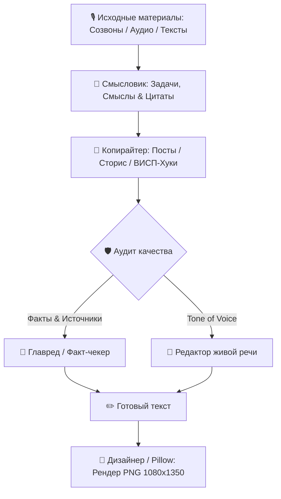

# 🚀 Content Agent System

> **Многоагентная ИИ-система полного цикла для производства экспертного контента** — от расшифровки созвонов, аудиозаметок и документов до готовых постов, сценариев Stories, хуков по ВИСП и программно сгенерированных каруселей 1080×1350.

[](https://www.python.org/downloads/)
[](https://opensource.org/licenses/MIT)
[](https://github.com/aiogram/aiogram)
[](https://cloud.google.com)

---

## 📌 Архитектура и принцип работы

Главный принцип системы — **«Упаковка, а не выдумка»**:
1. **Разделение труда**: Производство контента и аудит качества строго разведены между независимыми ролями.
2. **Защита от галлюцинаций (Zero-Fluff Fact Checking)**: Проверяющие роли работают в режиме **Read-Only** и сверяют каждое утверждение с реальной базой знаний и материалами эксперта.
3. **Естественный голос**: Тексты защищены от канцелярита, шаблонного инфостиля и токсичных штампов-раздражителей.



---

## 👥 Команда специалистов и роли

| Специалист | Ветка / Роль | Описание и функционал |
|---|---|---|
| ✍️ **Копирайтер** | `copywriter` / `content` | Экспертные посты для Telegram, драматургия Stories по кадрам, сценарии Reels и прогревы к запускам. |
| 🎨 **Дизайнер** | `designer` / `karusel` | Проектирование визуальной структуры (JSON) и компиляция каруселей 1080×1350 в PNG через модуль верстки. |
| 🔍 **Главред & Факт-чек** | `editor` / `fakt-check` | Жесткий аудит текста: сверка фактов с первоисточниками, вычитка стоп-слов, контроль живой речи и тире. *(Read-Only)* |
| 🎙 **Смысловик** | `analyst` / `sozvon-razbor` | Моментальный разбор аудиозаписей, кружков и транскриптов: извлечение задач, инсайтов и дословных цитат. |
| ⚙️ **Техспециалист** | `tech` | Инфраструктура проекта, Telegram-бот, серверное окружение, LLM-маршрутизация и скрипты автоматизации. |

---

## 🛠 Компоненты системы

### 1. Telegram-бот ассистент (`tg_bot/`)
- Построен на **Aiogram 3.x**.
- **Мультимодальный прием**: распознает голосовые сообщения и кружки (Whisper API), документы (`.docx`, `.pdf`, `.txt`), изображения и ссылки.
- **Поддержка форумов / тем (Topics)**: команда `/setup_forum` автоматически создает рабочие ветки для всех 5 специалистов с персональными инструкциями.
- **Ремикс чужого контента**: принимает пост или скриншот карусели конкурента, сохраняет вирусный хук и полностью переписывает текст в Tone of Voice эксперта с генерацией готовых слайдов.
- **Каскадный оркестратор LLM (`agent_runner.py`)**: Google Antigravity CLI (`agy`) → Anthropic Claude 3.5/4.5 (Polza AI / Direct API) → Google Gemini 2.5 Flash.

### 2. Программный генератор каруселей (`carousel_generator/`)
- Генерация слайдов высокой четкости **1080×1350 (4:5)** на базе **Pillow (PIL)**.
- Автоматический перенос строк, расчет вертикальных отступов и выравнивание.
- Типографическая система: обложки (`cover`), акцентные перебивки (`break`), списки и чек-листы (`list`), финальные слайды с CTA (`cta`).
- Поддержка авто-кадрирования аватара эксперта на обложке и в финале.

### 3. Скиллы для ИИ-ассистентов (`.agents/skills/`, `.claude/`, `.codex/`)
- Совместимы с **Claude Code**, **OpenAI Codex**, **Google Antigravity IDE** и **Antigravity CLI**:
  - `expert-storytelling` — драматургия сторис по кадрам с интерактивами.
  - `tg-channel-posts` — прогревающие контент-планы и публикации для Telegram.
  - `visp-hooks` — формула ВИСП для Reels и вирусных заголовков.

---

## 📂 Структура проекта

```
content-agent-system/
├── .agents/
│   └── skills/                # Скиллы для ИИ-ассистентов (Markdown + Frontmatter)
├── .claude/
│   ├── agents/                # Промпты ролей для Claude Code (.md)
│   └── skills/                # Скиллы проекта для Claude Code
├── .codex/
│   └── agents/                # Промпты ролей для Codex (.toml)
├── tg_bot/
│   ├── main.py                # Точка входа Telegram-бота
│   ├── config.py              # Конфигурация и переменные окружения
│   ├── requirements.txt       # Python-зависимости бота
│   ├── deploy/                # Systemd service и скрипты деплоя
│   ├── engine/
│   │   ├── agent_runner.py    # LLM-оркестратор (Antigravity / Claude / Gemini / Whisper)
│   │   ├── carousel_builder.py# Динамическая сборка карточек из JSON
│   │   ├── file_extractor.py  # Извлечение текста из docx, pdf, аудио
│   │   ├── formatter.py       # Telegram MarkdownV2 / HTML форматирование
│   │   ├── insta_monitor.py   # Модуль мониторинга и ремикса рилсов
│   │   └── prompts.py         # Менеджер промптов и интеграции скиллов
│   └── handlers/
│       └── router.py          # Обработчики команд, форумов и диалогов
├── carousel_generator/
│   ├── build_karusel.py       # Движок верстки слайдов на Pillow
│   ├── decks.py               # Шаблоны и примеры каруселей
│   └── photo.jpg              # Аватар для обложек и CTA
├── AGENTS.md                  # Корневой манифест правил системы и голоса
├── CLAUDE.md                  # Системные инструкции для Claude Code
├── .env.example               # Шаблон переменных окружения
├── .gitignore
├── LICENSE                    # MIT License
├── requirements.txt
└── README.md
```

---

## ⚡️ Быстрый старт

### 1. Клонирование и установка зависимостей

```bash
git clone https://github.com/alexrexby/content-agent-system.git
cd content-agent-system

python3 -m venv venv
source venv/bin/activate  # На Windows: venv\Scripts\activate
pip install -r requirements.txt
```

### 2. Настройка переменных окружения

Скопируйте `.env.example` в `.env` и укажите необходимые ключи:

```bash
cp .env.example .env
```

Отредактируйте `.env`:
```ini
# Токен бота из @BotFather
BOT_TOKEN=1234567890:ABCdefGHIjklMNOpqrSTUvwxYZ

# API-ключ для Claude 3.5 / Polza AI (или прямой OpenAI / Gemini)
POLZA_API_KEY=your_polza_api_key
AI_BASE_URL=https://api.polza.ai/api/v1
CLAUDE_MODEL=anthropic/claude-sonnet-4.5

# Опционально: Google Gemini
GEMINI_API_KEY=AIzaxxxxxxxxxxxxx

# Юзернейм канала/блога для каруселей
EXPERT_HANDLE=@expert_channel
```

### 3. Запуск Telegram-бота

```bash
python -m tg_bot.main
```

Для создания рабочих веток специалистов в Telegram-группе:
1. Включите **«Темы» (Topics)** в настройках вашей группы.
2. Отправьте в группу команду `/setup_forum`.

### 4. Генерация каруселей через консоль

Собрать все предустановленные карусели:
```bash
python carousel_generator/build_karusel.py
```

Собрать конкретную тему:
```bash
python carousel_generator/build_karusel.py voda
```

Собрать карусель из произвольного JSON-файла:
```bash
python carousel_generator/build_karusel.py --json path/to/deck.json path/to/output_dir
```

---

## 🎯 Формула ВИСП для хуков

Каждый заголовок и первый кадр контента валидируется по 4 осям:
- **В (Выгода)**: что конкретно получит читатель (деньги, время, спокойствие).
- **И (Интрига)**: разрыв шаблона, парадокс, неожиданный факт.
- **С (Срочность)**: почему это нужно внедрить прямо сейчас (сезонность, потери).
- **П (Причастность)**: точное попадание в статус и боли целевой аудитории.

---

## 📜 Лицензия

Проект распространяется под лицензией [MIT](LICENSE).
